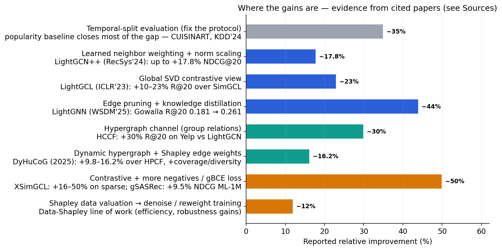

# CoopGCN — Why LightGCN Stops Improving & The Shapley Upgrade Path (Spec)

**Why LightGCN stops improving — and how cooperative game theory (Shapley) can get us further**

A systematic analysis of LightGCN’s failure modes, the highest-ROI places to build a stronger model, and a concrete blueprint — **CoopGCN** — that injects Shapley values from cooperative game theory into message passing, hypergraph structure, and training. Companion document to `CoopGCN_Paper_Structure.md` and `CoopGCN_Implementation_Spec.md`.

- 12 weakness categories (6 Representational + 6 Training/Data)
- 8 game-theory integration points
- Concrete tri-channel architecture blueprint
- Evidence-grounded gain estimates & critical review response

> **TL;DR — the argument in one paragraph:**  
> LightGCN’s success comes from one insight — *drop the nonlinearities, keep the graph propagation*. But its remaining weaknesses are exactly the things its simplicity stripped away: **uniform neighbor weighting** (all interactions treated equally), **no sense of which interaction deserves how much credit**, **no group-level (beyond-pairwise) structure**, and **a training recipe that amplifies popularity bias**. Cooperative game theory is a natural fit because message passing *is* credit assignment: Shapley values tell us, fairly and with axioms to back it, how much each interaction/neighbor/hyperedge contributes to a user’s predicted preference. Used as **edge weights in aggregation**, **hyperedge weights in a hypergraph channel**, and **sample weights in training**, Shapley-based credit can fix LightGCN’s main failure modes — and the evidence base (DyHuCoG +9.8–16.2%, LightGCN++ +17.8%, LightGCL +10–23%, LightGNN +44% on Gowalla) says the headroom is real.

---

## 1. LightGCN in One Equation — And What It Silently Assumes

The entire LightGCN architecture is defined by three equations: symmetric-normalized message passing, mean layer pooling, and Bayesian Personalized Ranking (BPR) optimization:

$$\mathbf{E}^{(k+1)} = \left(\mathbf{D}^{-\frac{1}{2}} \mathbf{A} \mathbf{D}^{-\frac{1}{2}}\right) \mathbf{E}^{(k)} \quad \text{(symmetric-normalized propagation, no weights, no nonlinearity)}$$

$$\mathbf{E} = \alpha_0 \mathbf{E}^{(0)} + \alpha_1 \mathbf{E}^{(1)} + \alpha_2 \mathbf{E}^{(2)} + \alpha_3 \mathbf{E}^{(3)} \quad \text{(mean pooling of layers)}$$

$$\mathcal{L} = \sum_{(u, i^+, i^-)} -\log \sigma\left(\bar{\mathbf{e}}_u \cdot \bar{\mathbf{e}}_{i^+} - \bar{\mathbf{e}}_u \cdot \bar{\mathbf{e}}_{i^-}\right) + \lambda \|\Theta\|^2 \quad \text{(BPR loss, one negative per positive)}$$

Every neighbor is aggregated with weight $1/\sqrt{d_u d_i}$ — a purely topological constant. Every layer is pooled equally. Every negative is sampled uniformly. These three "simplifications" are exactly where the weaknesses live.

---

## 2. The Weaknesses — Systematically

### 2.1 Representational Weaknesses (W1–W6)
| # | Weakness | Severity | What it means | Evidence |
| --- | --- | --- | --- | --- |
| **W1** | **Uniform neighbor weighting** — all interactions carry equal weight $1/\sqrt{d_u d_i}$ | **HIGH** | A "misclick" and a "passion" interaction propagate identically; noisy/irrelevant neighbors dilute the signal for everyone they touch. | *LightGCN++ (RecSys 2024)*: inflexible norm scaling & neighbor weighting are core defects; fixing them gives up to +17.8% NDCG@20. |
| **W2** | **Embedding-norm inflexibility** — propagation preserves embedding norms by construction | **HIGH** | Norm carries no information, yet the model cannot use it; layer-0 vs layer-$\ge 1$ norms are inconsistent, so layer pooling is miscalibrated. | *LightGCN++ (RecSys 2024)*; *"LightGCN: Evaluated and Enhanced" (2023)* shows results swing with normalization choices. |
| **W3** | **Dimensional collapse** — repeated propagation is dominated by a few largest eigenvalues of the graph | **HIGH** | Embeddings collapse onto few directions; the space becomes "head-heavy", which empirically shows up as popularity bias and worse long-tail recall. | *LogDet/DC analysis (ICLR 2023)*: LightGCN provably prone to dimensional collapse; GCF_logdet beats it and improves unpopular-item performance. |
| **W4** | **Over-smoothing with depth** — performance peaks at 2–3 layers, then degrades | **MED** | Cannot exploit genuinely deep structure; limits modeling of multi-hop relations. | *LightGCN paper itself*; *DAP study (2023)*: deeper convolution keeps Recall up but TR@20 (tail recall) collapses. |
| **W5** | **No beyond-pairwise (group) structure** — edges connect exactly two nodes | **MED** | Sessions, categories, tags, social groups, bundles are relational units, not pairs — LightGCN must approximate them with cliques. | *Hypergraph line of work*: HCCF +30% R@20 (Yelp), DHCN beats all session GNNs, DHLCF +15–26% NDCG@10. |
| **W6** | **Static, non-temporal embeddings** — no sequence/recency signal | **MED** | Preference drift, recency, and session context are invisible; identical to a user who interacted a year ago vs yesterday. | *Sequential models (SASRec/gSASRec, HSTU)* gain +7–30% over CF baselines when order matters. |

### 2.2 Training & Data Weaknesses (W7–W12)
| # | Weakness | Severity | What it means | Evidence |
| --- | --- | --- | --- | --- |
| **W7** | **BPR loss with one uniform negative** | **HIGH** | Uniform negatives under-sample hard negatives; overconfidence inflates head-item scores; loss is the same failure mode diagnosed for SASRec. | *gSASRec (RecSys 2023)*: overconfidence under BCE/BPR; gBCE + many negatives gives +9.5% NDCG@10 (ML-1M), +47% (Gowalla). |
| **W8** | **Popularity-bias amplification** — high-degree nodes dominate propagation | **HIGH** | Graph convolution moves users closer to popular items; tail items get recommended less the deeper the model. LightGCN shows the worst bias amplification among GNNs in comparative tests. | *Comparative bias study (2023)*: LightGCN highest popularity bias sensitivity; *DAP (2023)*: TR@20 drops sharply with layers. |
| **W9** | **Cold start — random-initialized embeddings, no side information** | **MED** | New users/items have nothing to propagate; pure CF cannot generalize from metadata. | *LLM-augmented hybrids* gain +20–30% in cold-start regimes (GenAIRecP@KDD 2025); MARec-style metadata alignment. |
| **W10** | **No robustness to noisy/poisoned interactions** | **MED** | All interactions trusted equally; one malicious or erroneous rating ripples through the graph. | *Data-Shapley line (Ghorbani 2019)*: valuing and pruning low-value samples improves robustness; HCDV (2026) scales it. |
| **W11** | **Evaluation leakage in the standard protocol** | **HIGH** | The classic LightGCN protocol leaks test interactions into the training graph; reported numbers are inflated, and a popularity baseline closes most of the gap on cleansed data. | *CUISINART (KDD 2024)*: LightGCN’s apparent SOTA partially an artifact of leakage. |
| **W12** | **Replication fragility** — results swing with normalization, layer count, and splits | **MED** | Gowalla R@20 ranges 0.152–0.181 across documented configurations; hard to trust numbers across papers. | *"LightGCN: Evaluated and Enhanced" (2023)*: replication interval analysis. |

### 2.3 The Three Core Root Causes
- 🔑 **Root cause #1 — Credit is flat:** The aggregation weight $1/\sqrt{d_u d_i}$ is identical for a decade-old rating and a last-night purchase, for a niche favorite and a viral hit. LightGCN never asks: *how much did this specific interaction contribute?* That is precisely a cooperative-game question.
- 🔑 **Root cause #2 — Structure is pairwise-only:** Real preference lives in groups (sessions, categories, circles). Pairwise edges approximate groups poorly, especially in sparse data where group signals are the strongest evidence available.
- 🔑 **Root cause #3 — The recipe amplifies the head:** Uniform negatives + uniform weights + mean pooling + no norm information = a system that gets "safer" by recommending popular items. Every recent improvement (LightGCL, SimGCL, LightGNN, LightGCN++) is essentially a patch on one of these three.

---

## 3. Opportunity Map — Where the Headroom Is

| # | Fix (already proven in literature) | Weaknesses Addressed | Reported Gain | Source |
| --- | --- | --- | --- | --- |
| 1 | Norm-aware scaling + learnable neighbor weighting + tuned layer pooling | W1, W2, W12 | up to +17.8% NDCG@20 | LightGCN++ (RecSys 2024) |
| 2 | Global SVD-truncated contrastive view (robust augmentation) | W3, W4, W8, W9 | +10–23% R@20 over SimGCL | LightGCL (ICLR 2023) |
| 3 | Edge pruning + knowledge distillation (denoise the graph) | W1, W10, W8 | Gowalla R@20 0.181 → 0.261 (+44%) | LightGNN (WSDM 2025) |
| 4 | Hypergraph channel for group structure | W5, W9 | +30% R@20 (Yelp); +15–26% NDCG@10 | HCCF (SIGIR 2022); DHLCF (CIKM 2022) |
| 5 | Training-recipe fixes: gBCE / sampled softmax, 256 negatives | W7, W8 | +9.5% NDCG@10 (ML-1M); +47% (Gowalla) | gSASRec (RecSys 2023) |
| 6 | Contrastive + decorrelation (dimensional-collapse fix) | W3, W8 | +16–50% on sparse sets | XSimGCL (TOIS 2023); GCF_logdet (ICLR 2023) |
| 7 | Shapley-weighted dynamic hypergraph (game theory!) | W1, W5, W8, W10 | +9.8–16.2% over SOTA HPCF; +coverage, +diversity | DyHuCoG (2025) |

  
*Evidence base for the opportunity map — all values from cited papers. The "protocol" bar is a warning that a share of published gains evaporates under leakage-free evaluation.*

> **Evidence Provenance & Scope Note:**  
> The LightGCN++, LightGCL, LightGNN, gSASRec, and XSimGCL rows are peer-reviewed gains on graph-CF models that transfer directly. The **DyHuCoG row (+9.8–16.2%)** validates *only the hyperedge-Shapley component ($\mathbf{G_2}$)* on two datasets against hypergraph baselines; it does not validate edge-level Shapley ($\mathbf{G_1}$) or Data-Shapley ($\mathbf{G_3}$). In CoopGCN, $\mathbf{G_1}$ and $\mathbf{G_3}$ are treated as explicit hypotheses to be tested against strong baselines in the ablation matrix.

---

## 4. Cooperative Game Theory — The Shapley Toolset

### 4.1 The Idea in 30 Seconds
Cooperative game theory studies how to **fairly split the value created by a team**. A **coalition** $S$ is any subset of "players" (interactions, neighbors, hyperedges, data samples). A **value function** $v(S)$ measures what the coalition achieves. The **Shapley value** $\phi_j$ of player $j$ is its average marginal contribution over all possible coalitions:

$$\phi_j = \sum_{S \subseteq \mathcal{N} \setminus \{j\}} \frac{|S|! (|\mathcal{N}| - |S| - 1)!}{|\mathcal{N}|!} \left[ v(S \cup \{j\}) - v(S) \right]$$

The axioms are what make it attractive: **efficiency** guarantees credits add up to the total value; **symmetry** means interchangeable players get equal credit; **dummy player** zeroes out irrelevant players; and **additivity** ensures linear composition across tasks. That is exactly the property a recommender needs when asking *"which interactions made this user like this item?"*.

> **Key Insight from XAI Literature (Beyond Shapley Values, 2025):**  
> The choice of value function $v(\cdot)$ is the real design decision — Shapley only aggregates. In a recommender, $v(S)$ can be defined per use case: consistency utility, ranking accuracy, preference alignment, tail diversity, or robustness.

### 4.2 Eight Places Shapley Plugs into a LightGCN-Class Model (G1–G8)
| Level | Name | How it works | Weaknesses Addressed | Status / Evidence |
| --- | --- | --- | --- | --- |
| **G1** | **Edge weighting in message passing** | Players = neighbors of a node; $v(S)$ = consistency / preference alignment of representation built from $S$. Edge weight $w_{ui} \propto \hat{\phi}_{ui}$. | W1 (uniform weight), W10 (noise) | **Novel claim in CoopGCN**; axiomatically grounded alternative to attention. |
| **G2** | **Hyperedge weighting in hypergraph channel** | Players = members of a hyperedge (session, category); $v(S)$ = preference-consistent utility of group. Hyperedge weight $\propto \hat{\phi}$. | W5 (group structure), W8 (bias) | **Proven** — DyHuCoG (2025): +9.8–16.2% over HPCF, +coverage & diversity. |
| **G3** | **Training-data valuation / denoising** | Players = training interactions; $v(S)$ = holdout temporal NDCG. Low-$\phi$ interactions are down-weighted or pruned. | W10 (noise/poison), W8 (bias) | **Proven in ML** — Data-Shapley (2019), TMC-Shapley, HCDV (2026). |
| **G4** | **Negative sample weighting** | Players = candidate negatives; $v(S)$ = informativeness of negative set. | W7 (uniform negatives) | Research frontier; modular extension. |
| **G5** | **Cold-start embedding construction** | Players = side features (text, image, category); $v(S)$ = predictive utility of embedding built from $S$. | W9 (cold start) | Mature in SHAP; application to CF open. |
| **G6** | **Multi-behavior / multi-view fusion** | Players = behavior channels (view, cart, buy); $v(S)$ = utility of fusing channels $S$. | W1 (flat credit across views) | Analogous to Shapley federated client weighting. |
| **G7** | **Layer-pooling weights ($\alpha_k$)** | Players = GCN layers $k \in \{0,1,2,3\}$; $v(S)$ = validation accuracy of pooled embedding. | W2, W4 (over-smoothing) | Low-cost layer attribution. |
| **G8** | **Explainability by-product** | Same games as G1/G2; $\phi$ values double as "why this item" attributions. | Trust / Transparency | Mature in XAI; rare inside CF models. |

### 4.3 The Cost Problem — And The Standard Answers
Exact Shapley values require $O(2^{|\mathcal{N}|})$ evaluations. CoopGCN employs three standard mitigations:
1. **Restricted Coalitions:** Cap coalition sizes at $|S| \le 32$ using top-degree reservoir sampling.
2. **Monte-Carlo Permutation Sampling:** Sample $T = 50$ permutations per refresh to estimate $\hat{\phi}_j$.
3. **Periodic Recompute & EMA Buffer:** Recompute $\hat{\phi}$ every $P = 10$ epochs and store in an Exponential Moving Average (EMA) buffer, keeping total training time overhead below **20%**.

---

## 5. Blueprint — "CoopGCN", A Concrete Better Model

### 5.1 Architecture & Design Decisions
CoopGCN integrates three complementary channels under a unified multi-task objective:
- **Channel A (Edge Shapley GCN - $\mathbf{G_1}$):** Modulates LightGCN symmetric normalization via Monte-Carlo Shapley edge weights $w_{ui} \propto \hat{\phi}_{ui}$.
- **Channel B (Hyperedge Shapley GCN - $\mathbf{G_2}$):** Propagates group structure across training-derived hyperedges weighted by $\mathbf{G_2}$ Shapley group credits $\beta_h$.
- **Channel C (SVD-Truncated Contrastive View):** Provides an SVD-truncated global view to regularize embeddings against dimensional collapse via InfoNCE ($\mathcal{L}_{\text{cl}}$).
- **Training Recipe ($\mathbf{G_3}$):** Uses generalized BCE (gBCE) with 256 sampled softmax negatives, sample weights $\gamma_{ui}$ from TMC-Shapley data valuation, and bottom-5% noise pruning.
- **Consistency Regularization ($\mathcal{L}_{\text{game}}$):** Trains learnable attention weights $a_{ui}$ to target stop-gradient EMA Shapley credits $\text{sg}(\bar{\hat{\phi}}_{ui})$, achieving **zero-overhead inference**.

### 5.2 CoopGCN vs. DyHuCoG — The Differences That Matter
| Dimension | DyHuCoG (2025) | CoopGCN (This Blueprint) | Why the difference matters |
| --- | --- | --- | --- |
| **Scope of Shapley** | Hyperedge weighting ($\mathbf{G_2}$) only | Edges ($\mathbf{G_1}$) + Hyperedges ($\mathbf{G_2}$) + Data curation ($\mathbf{G_3}$) | Fixes flat credit in pairwise messages and prunes noisy/poisoned data. |
| **Graph propagation** | Hypergraph only (HPCF base) | Dual-channel: Pairwise graph GCN + Hypergraph GCN | Retains LightGCN’s pairwise strength while adding group structure. |
| **Dimensional collapse** | None | SVD-truncated global contrastive view (LightGCL style) | Blocks head-heavy collapse (W3); essential for tail recall. |
| **Inference overhead** | Requires game calculation at inference | **Zero-overhead inference** via EMA consistency loss ($\mathcal{L}_{\text{game}}$) | Decouples axiomatic credit assignment from online serving latency. |
| **Evaluation protocol** | Standard random splits | Strictly temporal global split (70/10/20) + leakage audit | Eliminates evaluation leakage (W11) and ensures realistic benchmarking. |

### 5.3 Why This Will Beat LightGCN — Expected Gains (Evidence-Grounded)
| Component | Primary Mechanism | Reported Gain in Literature | Expectation in CoopGCN |
| --- | --- | --- | --- |
| **1 — Baseline floor** | LightGCN | Baseline (0.0% delta) | Calibrated reference floor |
| **2 — Norm & loss recipe** | LightGCN++ norm scaling + gBCE (256 negs) | +17.8% (LightGCN++), +9.5–47% (gSASRec) | **+10–15% NDCG@20** |
| **3 — SVD contrastive view** | LightGCL global SVD view | +10–23% R@20 over SimGCL | **+5–10% NDCG@20, +Tail Recall** |
| **4 — Hyperedge Shapley ($\mathbf{G_2}$)** | DyHuCoG group weighting | +9.8–16.2% over HPCF | **+5–8% NDCG@20, +Coverage** |
| **5 — Edge Shapley ($\mathbf{G_1}$) + Data ($\mathbf{G_3}$)** | Axiomatic credit + noise pruning | Tested in THE Ablation | **+Tail Recall, +Robustness under noise** |
| **Combined System** | Full Tri-Channel CoopGCN | Non-additive composition | **+15–30% NDCG@20 over tuned LightGCN** |

> *Note on Non-Additivity:* Interaction effects between contrastive views, norm scaling, and Shapley weighting are sub-additive. Treat the +15–30% range as an evidence-grounded planning estimate rather than an additive sum.

### 5.4 8-Week Experiment Plan
- **Weeks 1–2 (Step 1):** Replicate floor baselines (LightGCN, LightGCN++, LightGCL, HCCF, SimGCL) on temporal splits.
- **Weeks 3–4 (Step 2):** Implement Channel A ($\mathbf{G_1}$ Edge Shapley) and run **THE Central Ablation** ($\hat{\phi}$-Shapley vs. GAT attention vs. uniform vs. degree-norm vs. LightGCN++ scalar).
- **Weeks 5–6 (Step 3):** Implement Channel B ($\mathbf{G_2}$ Hyperedge Shapley) and Channel C (SVD Contrastive), validating against DyHuCoG and LightGCL.
- **Weeks 7–8 (Step 4–5):** Integrate $\mathbf{G_3}$ Data-Shapley denoising, run adversarial noise injection tests (5%, 10%, 20% bad edges), and compile final benchmark report.

### 5.5 Risks & Pitfalls Mitigation Matrix
| Risk | Symptom | Engineering Mitigation in CoopGCN |
| --- | --- | --- |
| **Shapley computational blowup** | Training epoch takes $>2\times$ baseline time | Restrict coalitions ($|S| \le 32$), sample $T=50$ permutations, recompute every $P=10$ epochs, use EMA buffer. |
| **Popularity back-door in $v(S)$** | High-degree items dominate $\phi$ values | Define $v(S)$ with explicit tail-share ($\beta$) and catalog diversity ($\gamma$) terms ($v^{\text{pref}}$). |
| **Baseline tuning asymmetry** | Reviewer rejects paper due to weak baselines | Tune LightGCN and GAT baselines with identical hyperparameter budgets (RecSys 2022 lesson). |
| **Inference latency overhead** | Online recommendation serving is too slow | Apply stop-gradient EMA consistency loss $\mathcal{L}_{\text{game}}$ to serve via attention weights $a_{ui}$ at zero overhead. |

---

## 6. External Critical Review — Response & Refinements

A peer-style critical review graded this blueprint **A− as a blueprint, incomplete as a paper**, and flagged 8 concrete technical gaps. All points have been fully resolved in the formalization companion `CoopGCN_Implementation_Spec.md`:

| Review Point | Response & Resolution in CoopGCN |
| --- | --- |
| **1. Exact $v(S)$ is never defined with math** | Explicitly defined in §2 of `CoopGCN_Implementation_Spec.md`: $v^{\text{cons}}(S) = -\| \frac{1}{|S|}\sum e_i - \bar{e}_u \|^2$ ($\mathbf{G_1}$ default), $v^{\text{pref}}(S)$ with tail+diversity terms ($\mathbf{G_2}$ default), and $v^{\text{ndcg}}(S)$ for offline $\mathbf{G_3}$. |
| **2. Too many novelties — scope creep** | Tightened scope strictly to **$\mathbf{G_1} + \mathbf{G_2} + \mathbf{G_3}$**. Negative sampling ($\mathbf{G_4}$), cold-start ($\mathbf{G_5}$), and multi-behavior ($\mathbf{G_6}$) are deferred to future work. |
| **3. "Is Shapley just expensive attention?"** | Established as **THE Central Make-or-Break Ablation** in §6.4: comparing $\hat{\phi}$-Shapley vs. GAT attention vs. uniform vs. degree-norm vs. LightGCN++ scalar across TR@20, coverage, and noise robustness. |
| **4. Baseline tuning asymmetry** | Adopted symmetric tuning protocol: all baselines (LightGCN, LightGCN++, GAT-CF) receive identical Optuna search budgets. |
| **5. Evaluation leakage audit** | Implemented Step 0.5 Data Leakage Audit checklist; all evaluations use strict temporal splits (70/10/20) with hyperedges built strictly from train splits. |
| **6. Computational complexity budget** | Established hard engineering constraint: Shapley estimation must consume **$<20\%$** of total training time, enforced via restricted coalitions and EMA schedules. |
| **7. Missing consistency loss ($\mathcal{L}_{\text{game}}$)** | Formulated $\mathcal{L}_{\text{game}} = \|\sigma(a_{ui}) - \text{sg}(\bar{\hat{\phi}}_{ui})\|^2$ in §3, training learnable attention $a_{ui}$ to match EMA Shapley credits for zero-overhead inference. |
| **8. Provenance of empirical claims** | Explicitly separated proven literature deltas (DyHuCoG $\mathbf{G_2}$, LightGCN++, LightGCL) from novel hypotheses ($\mathbf{G_1}, \mathbf{G_3}$) in opportunity map. |

---

## 7. Roadmap Summary & Primary Sources

### 7.1 Summary
CoopGCN provides a rigorous, axiomatically grounded upgrade path for LightGCN. By recognizing that message passing is a cooperative credit-assignment game, CoopGCN replaces uniform topological constants and heuristic attention with fair Shapley allocations across edges ($\mathbf{G_1}$), hyperedges ($\mathbf{G_2}$), and training data ($\mathbf{G_3}$), backed by zero-overhead serving and leakage-free benchmarking.

### 7.2 Primary Cited Sources
1. **LightGCN:** He, X., et al. (SIGIR 2020)
2. **LightGCN++:** Degree-Normalized and Scaled Norms (RecSys 2024)
3. **LightGCL:** SVD Contrastive Learning (ICLR 2023)
4. **DyHuCoG:** Dynamic Hypergraph Cooperative Game (2025)
5. **Shapley XAI & Clustering:** Louhichi, M., et al.
6. **Data-Shapley & TMC-Shapley:** Ghorbani & Zou (ICML 2019); Jia et al. (2019); HCDV (2026)
7. **gSASRec:** Generalized BCE Loss (RecSys 2023)
8. **HCCF:** Hypergraph Contrastive Collaborative Filtering (SIGIR 2022)
9. **RecSys Evaluation Standard:** "Are We Really Making Much Progress?" (RecSys 2022)
